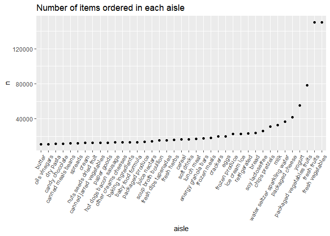
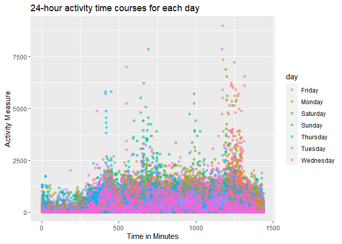
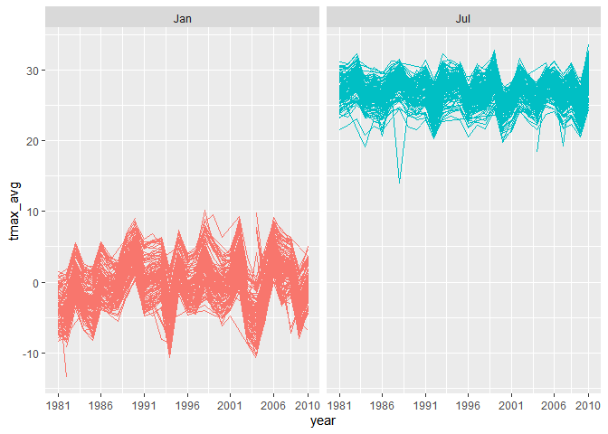
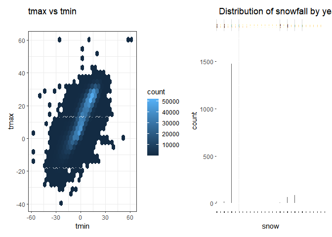

p8105_hw3_as6447
================
Armaan Sodhi
2022-10-12

\##Problem0

``` r
library(tidyverse)
```

    ## ── Attaching packages ─────────────────────────────────────── tidyverse 1.3.2 ──
    ## ✔ ggplot2 3.3.6      ✔ purrr   0.3.4 
    ## ✔ tibble  3.1.8      ✔ dplyr   1.0.10
    ## ✔ tidyr   1.2.0      ✔ stringr 1.4.1 
    ## ✔ readr   2.1.2      ✔ forcats 0.5.2 
    ## ── Conflicts ────────────────────────────────────────── tidyverse_conflicts() ──
    ## ✖ dplyr::filter() masks stats::filter()
    ## ✖ dplyr::lag()    masks stats::lag()

``` r
library(ggridges)
library(hexbin)
library(patchwork)
library(p8105.datasets)
```

\##Problem1 \#### Read in the data

``` r
data("instacart")

instacart = 
  instacart %>% 
  as_tibble(instacart)
```

#### Answer questions about the data

This dataset contains 1384617 rows and 15 columns, with each row
resprenting a single product from an instacart order. Variables include
identifiers for user, order, and product; the order in which each
product was added to the cart. There are several order-level variables,
describing the day and time of the order, and number of days since prior
order. Then there are several item-specific variables, describing the
product name (e.g. Yogurt, Avocado), department (e.g. dairy and eggs,
produce), and aisle (e.g. yogurt, fresh fruits), and whether the item
has been ordered by this user in the past. In total, there are 39123
products found in 131209 orders from 131209 distinct users.

Below is a table summarizing the number of items ordered from aisle. In
total, there are 134 aisles, with fresh vegetables and fresh fruits
holding the most items ordered by far.

``` r
instacart %>% 
  count(aisle) %>% 
  arrange(desc(n))
```

    ## # A tibble: 134 × 2
    ##    aisle                              n
    ##    <chr>                          <int>
    ##  1 fresh vegetables              150609
    ##  2 fresh fruits                  150473
    ##  3 packaged vegetables fruits     78493
    ##  4 yogurt                         55240
    ##  5 packaged cheese                41699
    ##  6 water seltzer sparkling water  36617
    ##  7 milk                           32644
    ##  8 chips pretzels                 31269
    ##  9 soy lactosefree                26240
    ## 10 bread                          23635
    ## # … with 124 more rows

Next is a plot that shows the number of items ordered in each aisle.
Here, aisles are ordered by ascending number of items.

``` r
instacart %>% 
  count(aisle) %>% 
  filter(n > 10000) %>% 
  mutate(aisle = fct_reorder(aisle, n)) %>% 
  ggplot(aes(x = aisle, y = n)) + 
  geom_point() + 
  labs(title = "Number of items ordered in each aisle") +
  theme(axis.text.x = element_text(angle = 60, hjust = 1))
```

<!-- -->

Our next table shows the three most popular items in aisles
`baking ingredients`, `dog food care`, and `packaged vegetables fruits`,
and includes the number of times each item is ordered in your table.

``` r
instacart %>% 
  filter(aisle %in% c("baking ingredients", "dog food care", "packaged vegetables fruits")) %>%
  group_by(aisle) %>% 
  count(product_name) %>% 
  mutate(rank = min_rank(desc(n))) %>% 
  filter(rank < 4) %>% 
  arrange(desc(n)) %>%
  knitr::kable()
```

| aisle                      | product_name                                  |    n | rank |
|:---------------------------|:----------------------------------------------|-----:|-----:|
| packaged vegetables fruits | Organic Baby Spinach                          | 9784 |    1 |
| packaged vegetables fruits | Organic Raspberries                           | 5546 |    2 |
| packaged vegetables fruits | Organic Blueberries                           | 4966 |    3 |
| baking ingredients         | Light Brown Sugar                             |  499 |    1 |
| baking ingredients         | Pure Baking Soda                              |  387 |    2 |
| baking ingredients         | Cane Sugar                                    |  336 |    3 |
| dog food care              | Snack Sticks Chicken & Rice Recipe Dog Treats |   30 |    1 |
| dog food care              | Organix Chicken & Brown Rice Recipe           |   28 |    2 |
| dog food care              | Small Dog Biscuits                            |   26 |    3 |

Finally is a table showing the mean hour of the day at which Pink Lady
Apples and Coffee Ice Cream are ordered on each day of the week. This
table has been formatted in an untidy manner for human readers. Pink
Lady Apples are generally purchased slightly earlier in the day than
Coffee Ice Cream, with the exception of day 5.

``` r
instacart %>%
  filter(product_name %in% c("Pink Lady Apples", "Coffee Ice Cream")) %>%
  group_by(product_name, order_dow) %>%
  summarize(mean_hour = mean(order_hour_of_day)) %>%
  spread(key = order_dow, value = mean_hour) %>%
  knitr::kable(digits = 2)
```

    ## `summarise()` has grouped output by 'product_name'. You can override using the
    ## `.groups` argument.

| product_name     |     0 |     1 |     2 |     3 |     4 |     5 |     6 |
|:-----------------|------:|------:|------:|------:|------:|------:|------:|
| Coffee Ice Cream | 13.77 | 14.32 | 15.38 | 15.32 | 15.22 | 12.26 | 13.83 |
| Pink Lady Apples | 13.44 | 11.36 | 11.70 | 14.25 | 11.55 | 12.78 | 11.94 |

\##Problem2

``` r
Accel_data_tidy = 
   read_csv('data/accel_data.csv')%>%
   janitor::clean_names() %>%
   mutate(
      weekday_weekend = case_when(
         day %in% c('Monday', 'Tuesday','Wednesday','Thursday','Friday')~'weekday',
         day %in% c('Saturday','Sunday')~ 'weekend')
         )%>%
   relocate(weekday_weekend,.after=day)%>%
    pivot_longer(
      activity_1:activity_1440,
      names_to = 'time' ,
      names_prefix = 'activity_',
      values_to = 'activity_count'
   )%>%mutate(
      time = as.numeric(time)
   )
```

    ## Rows: 35 Columns: 1443
    ## ── Column specification ────────────────────────────────────────────────────────
    ## Delimiter: ","
    ## chr    (1): day
    ## dbl (1442): week, day_id, activity.1, activity.2, activity.3, activity.4, ac...
    ## 
    ## ℹ Use `spec()` to retrieve the full column specification for this data.
    ## ℹ Specify the column types or set `show_col_types = FALSE` to quiet this message.

From the use of `nrow` and `ncol` we find that there are 35 observations
and 1444 Variables. These include the variables for `week` (what week it
is), `day_id`(what number of day is it), `day`(what name of the day it
is), and `weekday_weekend` (if it is a weekend or weekday). We use pivot
longer to create the `time` and `activity_count` variables which tell us
the time at which the activity occured and the value of the activity
that occurred. The remaining variables are the `activity` variables are
the activity counts for each minute of a 24-hour day starting from
midnight.

``` r
Accel_data_agg=
   Accel_data_tidy%>%
   group_by(day,week)%>%
   summarize(
      total_activity=sum(activity_count)
   )%>%
   pivot_wider(
      names_from = 'day',
      values_from = 'total_activity'
   )%>%
   relocate(Sunday,Monday,Tuesday,Wednesday,Thursday,Friday, .after = week)%>% knitr::kable(digits = 2)
```

    ## `summarise()` has grouped output by 'day'. You can override using the `.groups`
    ## argument.

Using `summary(Accel_data_agg)` we can find that there is a decrease in
the `total activity` committed across `week` with the data from week 1
to week 5. There is also a decrease in the `total activity` committed
across the days with `Sunday` having the highest score (median 422018)
and `Saturday` having the lowest score (273847).

``` r
Accel_data_tidy %>%
   ggplot(aes(x = time, y = activity_count, color = day)) + 
   geom_point( alpha = 0.5) +
   labs(
      title = '24-hour activity time courses for each day ',
      x = 'Time in Minutes',
      y = 'Activity Measure'
   )
```

<!-- -->

``` r
ggsave("24-hour activity time courses for each day.pdf")
```

    ## Saving 7 x 5 in image

I created a scatterplot of the data evaulating the `Time in Minutes`
(x-value) compared to the`Activity Meausure` (y-value) and used color to
differentiate each point by the specific day in order to evaluate the 24
hour activity time courses foor each day.

From the plot we find that there are an increase in outlier later in the
week and day as there are significant outliers from `Sunday` has notable
outliers. Activity increases thoughout the `day` with activity
increasing at `500 minutes` and peaking between `1000` and
`1500 minutes`.I also feel that this problem showcases the issue with
large data, that using a scatterplot produces a somewhat jumbled mess
that is difficult to decipher.

\##Problem3

``` r
data("ny_noaa")
```

Using `summary(ny_noaa)` and `nrows` and `ncols` we find that there are
259176 observations and 7 variables. There is significant missing data
with there being 1372743 rows that contain missing data (from using
`ny_noaa%>%drop_na()`). Of the 7 variables there is `id`, which contains
the recording ID, `Date` whcih contains the date at which the event
occurs. `Snow` which is the quantity of snow on the ground,`Prcp` which
contains the precipitation data,`snwd`which contains the snowfall
dropped, and finally there is `tmin` and `tmax` which are the minimum
and maximum temperatures.Note that `tmin` and `tmax` are in units of
tenths of degrees C

``` r
ny_noaa_tidy =
   ny_noaa %>%
   janitor::clean_names()%>%
   separate(col = date, into = c('year','month','day'), sep = '-')%>%
      mutate(
         month = as.numeric(month),
         month = month.abb[month],
         tmax = as.numeric(tmax),
         tmin = as.numeric(tmin),
         year = as.numeric(year),
         tmax=(tmax/10),
         tmin=(tmin/10),
         prcp=(prcp/10)
         )

   ny_noaa_tidy%>%
   group_by(snwd)%>%
   summarize (n_obs = n())
```

    ## # A tibble: 318 × 2
    ##     snwd   n_obs
    ##    <int>   <int>
    ##  1     0 1621683
    ##  2     3     119
    ##  3     5     110
    ##  4     8     110
    ##  5    10      41
    ##  6    13    1670
    ##  7    15      34
    ##  8    18      33
    ##  9    20      62
    ## 10    23      19
    ## # … with 308 more rows

To clean the data I first had to separate the `date` variable into
`year`,`month`,and `day`.Then I converted the `month` variable into
abbreviated name variable. THen I converted `tmax` and `tmin` to
integers and years to `numeric`.Using the `group_by(snwd)` and
`summarize(n_obs = n())` functions we find that the majority (mean) of
observations in the `snwd` (amount snowfall) variable is `0`, with there
being `1621683` counts. Finally, I converted `tmax`, `tmin`, and `prcp`
to mm from tenths of a mm. This would make sense as it does not snow the
majority of the year and it does not snow evenly at each part of New
York.

``` r
ny_noaa_tidy = 
   ny_noaa_tidy%>%
    group_by(id,month,year) %>%
   mutate(
      tmax_avg = mean(tmax, na.rm = TRUE)
   )
```

``` r
   ny_noaa_tidy %>%
   filter(month %in% c('Jul','Jan')) %>%
   ggplot(aes(x = year, y = tmax_avg, group = id,color = month)) + 
   geom_line() + facet_grid(. ~ month) + theme(legend.position = "none")+
   scale_x_continuous(
      breaks = c(1981,1986,1991,1996,2001,2006,2010),
      labels = c('1981','1986','1991','1996','2001','2006','2010')
)
```

    ## Warning: Removed 174840 row(s) containing missing values (geom_path).

<!-- -->

``` r
ggsave('average max temperature (in C) in January and July.pdf')
```

    ## Saving 7 x 5 in image

    ## Warning: Removed 174840 row(s) containing missing values (geom_path).

I first created the `tmax_avg` variable by taking the `mean` of `tmax`
and selecting for `id`,`month`, and `year`.The I created the spaghetti
plot style graph. I simplified the x-lables by breaking it into every 5
years (except from 2006 to 2010.

The graph showcases an interesting structure, creating a wave like
structure.This would make sense as the temperature in `January` and
`July` would largely stay consistent with small fluctuations.

From analyzing the graph there are for `January` there are outliers in
the year 1984 where the `tmax_avg` reached below -10 C, There was also
an outlier in 1999 and 2004 where the `tmax_avg` reached 10 C. These
outliers seem to increase as the years progress (Yay climate change!)
With singificant amount of outliers occuring from `2001` to `2010`. In
July there is a signifcant outlier between 1986 and 1991 (close to 20
C). There were were outliers below -10 C between 1981 and 1986.

``` r
 tmax_vs_tmin=   
   ny_noaa_tidy %>%
   ggplot(aes(x = tmin, y = tmax)) + 
   geom_hex() + theme_bw()+
   labs(title = "tmax vs tmin")

   snows=
   ny_noaa_tidy %>% 
   filter (snow > 0 & snow < 100)%>%
   ggplot(aes(x = snow)) + 
   geom_histogram() +
   facet_grid(. ~ year) +
   theme(axis.text.x = element_blank(), legend.position = "none")+
   labs(title = " Distribution of snowfall by year") 
   
   (tmax_vs_tmin + snows)
```

    ## Warning: Removed 1136276 rows containing non-finite values (stat_binhex).

    ## `stat_bin()` using `bins = 30`. Pick better value with `binwidth`.

<!-- -->

``` r
   ggsave('tmax (in mm) vs tmin (in mm) and Distribution of snowfall by year.pdf')
```

    ## Saving 7 x 5 in image

    ## Warning: Removed 1136276 rows containing non-finite values (stat_binhex).

    ## `stat_bin()` using `bins = 30`. Pick better value with `binwidth`.

This graph evaluates a hex graph for the `minimum temperature` vs
the`maximum temperature`and compares it by the distribution of snowfall
by year.We find the distribution of snowfall decreases over the years
significantly, with an increase in outlying high snowfall years. However
as there are so many graphs it is difficult to tell which years this is.
It is interesting to note that there is a low snowall amount both before
and after a high snowfall year. In the context of this increasing
distribution of snow it is interesting to consider just how much overlap
there is between the `tmax` and `tmin` between 0 and 30 C.
